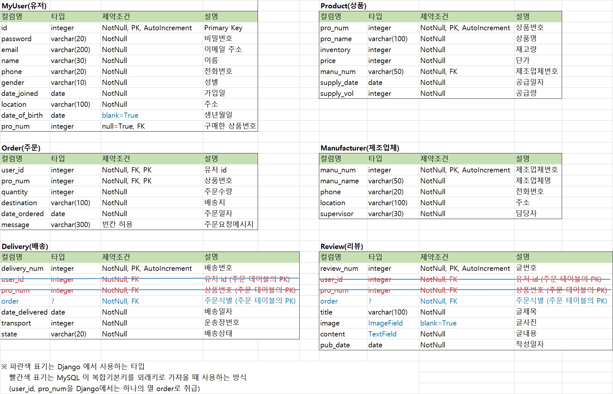
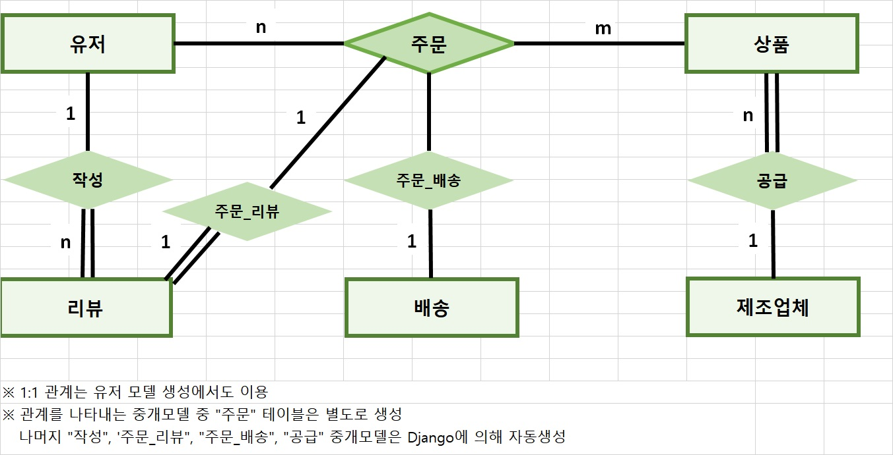
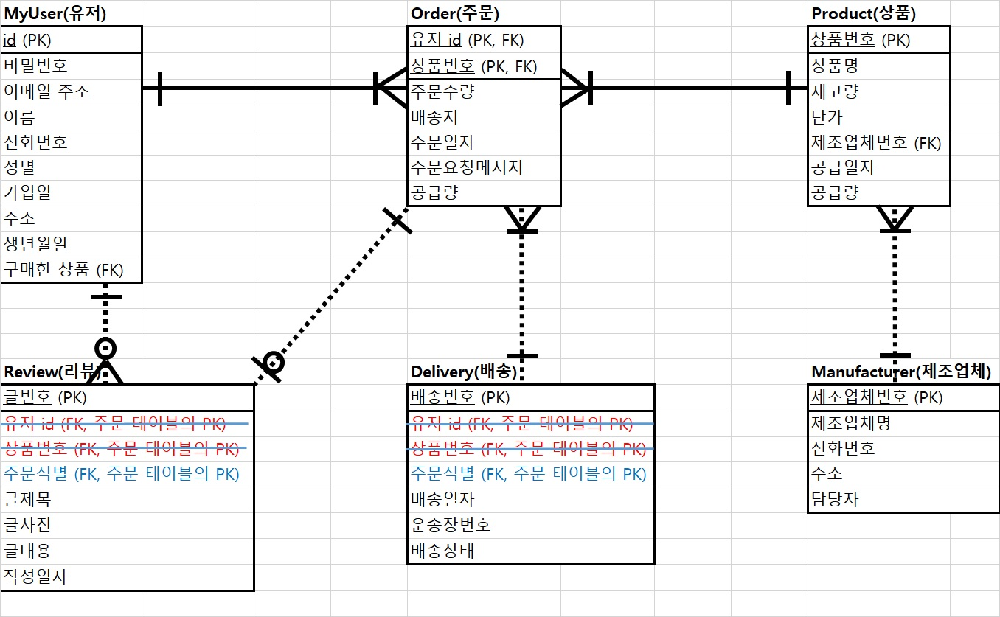

# django REST framework 과제 (for ceos 11th)

## 유의사항
* 본 레포지토리는 백엔드 스터디 2-3주차의 과제를 위한 레포입니다.
* 따라서 해당 레포를 fork 및 clone 후 local에서 본인의 깃헙 ID 브랜치로 작업한 후 커밋/푸시하고,
PR 보낼 때도 `본인의 브랜치-> 본인의 브랜치`로 해야 합니다.
 
## 2주차 과제 (기한: 4/12 일요일까지)
[과제 안내](https://www.notion.so/3-Django-ORM-c531472b37e844a6a6d484553037c243)

### 서비스 설명

<쇼핑몰 서비스>  
쇼핑몰에서 가장 핵심적인 `'유저', '상품', '주문', '배송', '제조업체', '리뷰' ` 테이블을 설계했습니다.  
쇼핑몰 유저가 회원가입 혹은 로그인을 합니다.  
그리고 마음에 드는 상품을 주문합니다.  
주문이 들어간 상품은 배송 절차를 밟게 됩니다.  
배송완료된 상품을 받아본 유저는 리뷰를 작성합니다.  

### 모델 설명
* 테이블 설계도

* E-R Diagram (Type1)

* E-R Diagram (Type2)

### ORM 적용해보기
shell에서 save() 메소드가 잘 안 되어 디비 반영한 파일들을 지우고 다시 반영하면서 OperationalError가 발생했습니다.  
django.db.utils.OperationalError: (1366, "Incorrect string value: '\\xEC\\xA0\\x9C\\xEC\\xA1\\xB0...' for column 'name' at row 1")  
해결이 계속 안 되고 있어서 수정한 부분이 migrate 되지 못해서 shell 코드가 많지 않습니다ㅠㅠ 

* 테이블 생성된 모습

* shell

  

### 간단한 회고 
DB sql 문법과 Django ORM 문법이 달라서 원하는 논리를 풀어내는 데 시간이 걸렸습니다.  
모델 간 관계가 이상해져서 api/migrations 에 있는 파일들을 여러번 삭제하고 다시 반영했습니다.  
'유저:상품' 간의 관계가 N:M 관계인데 '주문' 테이블을 중개모델로 설정했는데 N:M 관계가 잘 잡힌 건지 헷갈립니다ㅠ  

---
##3주차 과제 (기한: 4/19 일요일까지)
[과제 안내](https://www.notion.so/4-DRF1-API-View-464f612bfd9e42e5945325a4ad253cbf)

##모델 선택 및 데이터 삽입
선택한 모델의 구조와 데이터 삽입 후의 결과화면을 보여주세요!

##모든 list를 가져오는 API
API 요청한 URL과 결과 데이터를 코드로 보여주세요!

##특정한 데이터를 가져오는 API
API 요청한 URL과 결과 데이터를 코드로 보여주세요!

##새로운 데이터를 create하도록 요청하는 API
요청한 URL 및 Body 데이터의 내용과 create된 결과를 보여주세요!

##(선택) 특정 데이터를 삭제 또는 업데이트하는 API
위의 필수 과제와 마찬가지로 요청 URL 및 결과 데이터를 보여주세요!

##간단한 회고
과제 시 어려웠던 점이나 느낀 점, 좋았던 점 등을 간단히 적어주세요!