# django REST framework 과제 (for ceos 11th)

### 서비스 설명

제가 선택한 서비스는 **영화관 서비스**입니다. 

정확히는 영화관 회원 **예매** 서비스입니다.

이 서비스를 이용하는 과정은 영화관의 회원이 로그인을 하는 것부터 시작됩니다.

그 후, 회원은 보고싶은 영화를 검색하고 영화관 지점을 선택합니다.

영화관 지점에서 상영스케줄을 보고 알맞은 시간대를 선택합니다.

자신이 앉고 싶은 좌석의 번호를 고릅니다.

마지막으로, 영화 티켓 결제를 하고 예약번호가 적힌 티켓(QR 코드 등)을 받습니다.

### 모델 설명

총 7개의 서비스 관련 모델과 1개의 유저 모델로 이루어져 있습니다.

**서비스 관련 모델**에는 movie, branch, theater, seat, schedule reservation(ticket), pay 이 있습니다.

* movie 모델 :

  - pk(=primary key) : movie_id

  - fk(=foreign key) : X

  - other fields : movie_title, genre

* branch 모델:
  - pk : branch_name
  
  - fk : X
  
  - other fields : location(지점 위치), total_theater(관의 개수)

* theater 모델 : 
  - pk : theater_no

  - fk : branch_name
  
  - other fields : total_seat(좌석 총 개수)

* seat 모델 :
  - pk : seat_no
  
  - fk : theater_no, branch_name
  
  - other fields : is_reservation(예약되어있는지 여부)

* schedule 모델 : 
  - pk : schedule_id
  
  - fk : branch_name, theater_no, movie_id
  
  - other fields : schedule_time, schedule_date

* reservation(ticket) 모델 : 
  - pk : reservation_id(예약번호) 
  
  - fk : schedule_id, branch_name, theater_no, seat_no, movie_id

* pay 모델 : 
  - pk : pay_id
  
  - fk : member_id(일대일 관계), reservation_id
  
  - other fields :  payment_date, price, payment_option

**유저 모델**은 member 모델입니다.
* member 모델 : 
  - pk : member_id 
  
  - pay모델과 일대일 관계입니다.

**참고 사진**

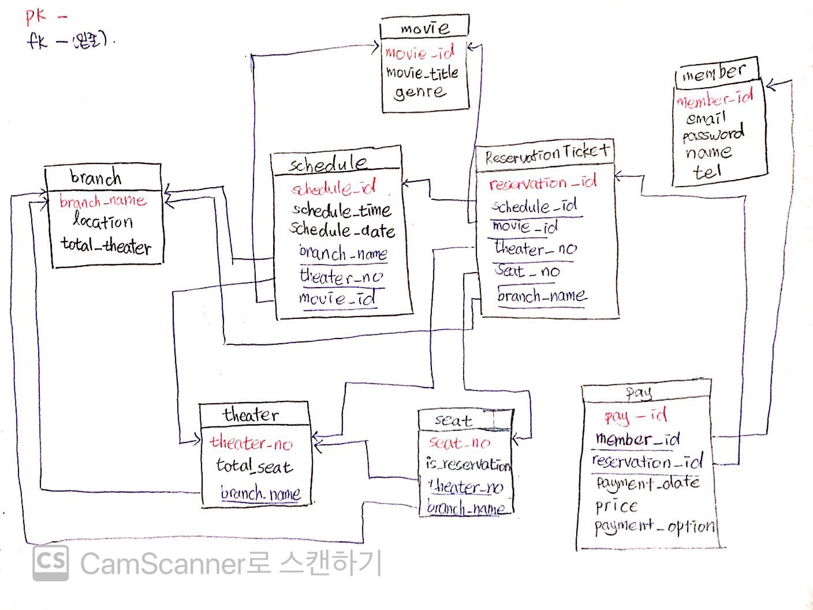

### ORM 적용해보기
1. 데이터베이스에 해당 모델 객체 3개 넣기 

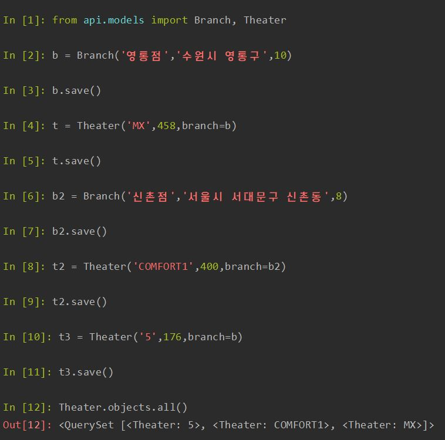

2. 삽입한 객체들을 쿼리셋으로 조회해보기 (단, 객체들이 객체의 특성을 나타내는 구분가능한 이름으로 보여야 함)

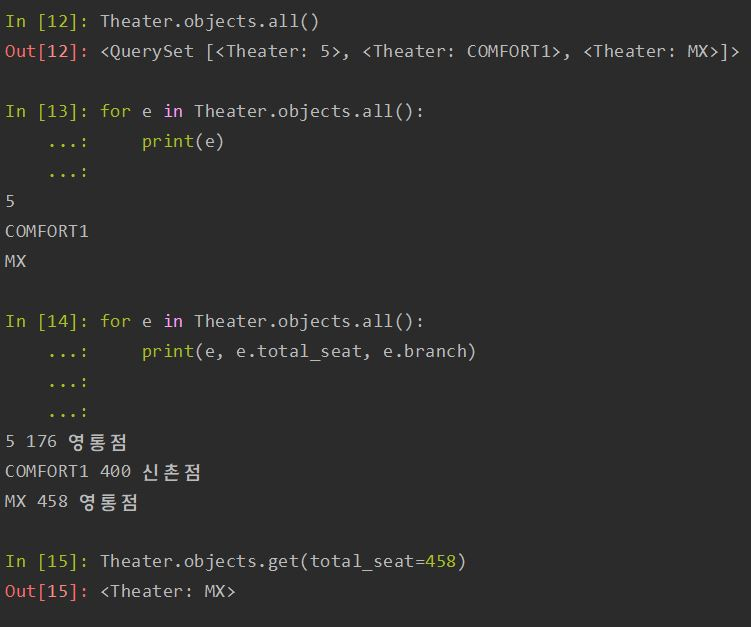

3. filter 함수 사용해보기

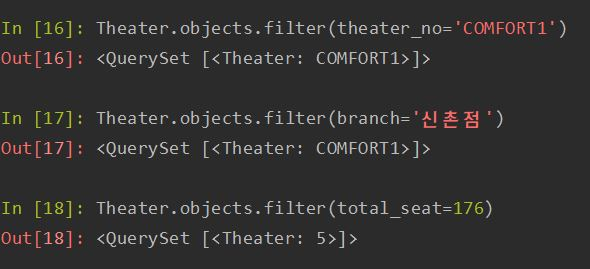 

### 간단한 회고 

	모델링을 처음해보아서 처음부터 어떻게 하는지 몰랐습니다ㅠ 
	하지만, 마침 듣는 데이터베이스 수업이 있어서 수업에서 들은 대로 처음에 그림을 그려놓고 시작하게 되었습니다. 
	모델을 다 만들어 놓고 필드를 잘못 선언하여 다 지우고 시작한 것이 한 3번 정도 있었습니다. 
	부분적으로 필드가 수정되는 경우도 있지만, 만일 그 필드가 외래키로 연결되어 있으면 다른 모델을 지우고 시작해야 하더라고요ㅠ 
	그래서 그냥 다 지우고 처음부터 시작했습니다. 
	부분적으로 수정할 수 있는 방법을 알게 되면 더 좋을 거 같습니다. 
	
	그리고 마지막에 객체 생성할 때 오류가 많이 났는데, 그 이유를 알아보려고 보니 보통 제가 필드를 선언할 때, 
	pk,fk,그냥 필드 순으로 선언을 했었는데요... 
	보통은 pk, 필드, fk 순으로 선언을 하는 것을 보고 무엇인가 잘못 되었다는 것을 깨달았습니다. 
	알고보니, python에서는 키워드 인자가 위치 인자 뒤에 와야된다는 사실을 뒤늦게 알게 되었습니다.
	이것 때문에 한 번 더 모델링을 다 지우고 시작했습니다ㅠ
	
	마지막으로, 제가 데이터 모델링을 해보았지만 단순히 저의 생각을 가지고 만든 것이기 때문에, 잘못된 부분이 많을 것 같습니다! 
	하지만, 어떤 것이 잘못된 것인지 감이 잡히지 않습니다... 많은 피드백 부탁드려요!
	

### 모델 선택 및 데이터 삽입
##### Schedule 모델
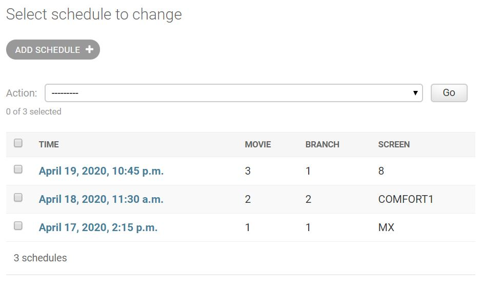
~~~
class Branch(models.Model):
    name = models.CharField(max_length=20, unique=True)
    location = models.CharField(max_length=50)

    def __str__(self):
        return self.name

class Screen(models.Model):
    name = models.CharField(max_length=10, primary_key=True)
    branch = models.ForeignKey('Branch', on_delete=models.CASCADE, related_name='screens')

    def __str__(self):
        return self.name

class Movie(models.Model):
    title = models.CharField(max_length=50)
    genre = models.CharField(max_length=20)

    def __str__(self):
        return self.title

class Schedule(models.Model):
    time = models.DateTimeField()
    movie = models.ForeignKey('Movie', on_delete=models.CASCADE, related_name='schedule')
    branch = models.ForeignKey('Branch', on_delete=models.CASCADE, related_name='schedule')
    screen = models.ForeignKey('Screen', on_delete=models.CASCADE, related_name='schedule')

    def __str__(self):
        return self.time
~~~

### 모든 list를 가져오는 API
##### ap1/schedule/ GET
~~~
HTTP 200 OK
Allow: GET, POST, HEAD, OPTIONS
Content-Type: application/json
Vary: Accept

[
    {
        "id": 1,
        "time": "2020-04-17T14:15:00+09:00",
        "movie": 1,
        "branch": 1,
        "screen": "MX"
    },
    {
        "id": 2,
        "time": "2020-04-18T11:30:00+09:00",
        "movie": 2,
        "branch": 2,
        "screen": "COMFORT1"
    },
    {
        "id": 3,
        "time": "2020-04-19T22:45:00+09:00",
        "movie": 3,
        "branch": 1,
        "screen": "8"
    }
]
~~~

### 특정한 데이터를 가져오는 API
##### api/schedule/3 GET
~~~
HTTP 200 OK
Allow: GET, PUT, PATCH, DELETE, HEAD, OPTIONS
Content-Type: application/json
Vary: Accept

{
    "id": 3,
    "time": "2020-04-19T22:45:00+09:00",
    "movie": 3,
    "branch": 1,
    "screen": "8"
}
~~~

### 새로운 데이터를 create하도록 요청하는 API
##### api/schedule POST
~~~
HTTP 201 Created
Allow: GET, POST, HEAD, OPTIONS
Content-Type: application/json
Vary: Accept

{
    "id": 4,
    "time": "2012-05-14T08:45:00+09:00",
    "movie": 1,
    "branch": 1,
    "screen": "8"
}
~~~

### (선택) 특정 데이터를 삭제 또는 업데이트하는 API
##### api/schedule/4 PUT
~~~
HTTP 200 OK
Allow: GET, PUT, PATCH, DELETE, HEAD, OPTIONS
Content-Type: application/json
Vary: Accept

{
    "id": 4,
    "time": "1999-03-18T08:00:00+09:00",
    "movie": 1,
    "branch": 1,
    "screen": "8"
}
~~~

### 간단한 회고
    튜토리얼을 따라 하다 보니까 API를 만들 수 있는 방법이 너무 많아서 처음에는 뭘로 코드를 짜야할 지 몰랐지만, 
    결국에는 제일 짧고 쉬운 걸로 코드를 짰어요ㅎㅎ 그리고 그냥 admin에 register만 하면, pk밖에 안 보여서 전체 column을
    보이게 하기 위해서 list_display를 사용했습니다! generics.~View를 사용하니 너무 편리하게 코드를 짤 수 있어서 좋았어요! 
    하지만, 과제를 하다보니까 약간 모델링이 잘못되었다는 생각도 들더라고요.. 
    예를 들면, 제가 생각하기에는 Branch와 Screen이 붙어다니길을 원했는데 Schedule을 보고 제가 다시 선택해야한다는 것을 알게되었어요ㅠ.ㅠ
    그리고, url연결할 때도 검색해보니 사람들이 r'^~'이런 표현을 많이 써서 무턱대고 따라 썼다가 아무것도 작동을 안하더라고요
    (r'^~'이 이전버전에 쓰이고 지금은 path로 대체된다는데 맞나요?)

    처음으로 django의 drf 기능을 사용해서 과제해봤는데 너무 편리한 것 같아요!
    틀린 부분 있으면 언제든지 피드백 해주세요 ᕕ( ᐛ )ᕗ
   
   
### 뷰셋으로 리팩토링 하기
~~~
class UserViewSet(viewsets.ModelViewSet):
    queryset = User.objects.all()
    serializer_class = UserSerializer
    permission_classes = [IsAdminOnly, ]

class BranchViewSet(viewsets.ModelViewSet):
    queryset = Branch.objects.all()
    serializer_class = BranchSerializer
    permission_classes = [IsAdminOnly,]

class ScreenViewSet(viewsets.ModelViewSet):
    queryset = Screen.objects.all()
    serializer_class = ScreenSerializer
    permission_classes = [IsAdminOnly, ]

class MovieViewSet(viewsets.ModelViewSet):
    queryset = Movie.objects.all()
    serializer_class = MovieSerializer
    permission_classes = [IsAdminOnly, ]

class ScheduleViewSet(viewsets.ModelViewSet):
    queryset = Schedule.objects.all()
    serializer_class = ScheduleSerializer
    permission_classes = [IsAdminOnly, ]
~~~
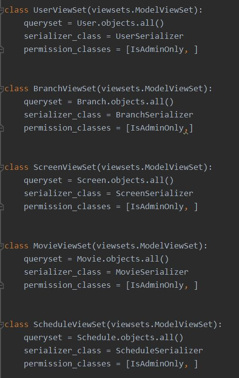 

### 뷰셋에 action 추가하기
~~~
class ScheduleViewSet(viewsets.ModelViewSet):
    queryset = Schedule.objects.all()
    serializer_class = ScheduleSerializer
    permission_classes = [IsAdminOnly, ]

    @action(detail=True, methods=['get'], url_path='get-running-time', url_name='get_running_time')
    def get_running_time(self, request, pk):
        schedule = self.get_object()
        serializer = ScheduleSerializer(schedule)
        finish = datetime.strptime(serializer.data['finish_time'], '%Y-%m-%dT%H:%M:%S%z')
        start = datetime.strptime(serializer.data['start_time'], '%Y-%m-%dT%H:%M:%S%z')
        running_time = (int) ((finish - start).seconds/60)
        return Response("running time : "+str(running_time)+"분")
~~~
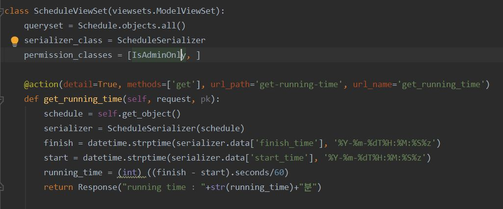

### 5주차 간단한 회고
    저번주에는 ListCreateAPIView와 RetrieveUpdateDestroyAPIView를 사용해서 구현했던 것을 ViewSet으로 모두 바꾸었습니다! 
    저번 것도 다른 것에 비해 비교적 코드가 짧았지만, viewset을 이용하니 더 간결해지네요!
    그리고 저는 ScheduleViewSet을 선정하여 @action을 이용해 영화 끝나는 시간에서 시작하는 시간을 빼서 러닝타임 시간을 계산했습니다!
    (그래서, 기존에 schedule 모델에 없었던 finish_time 필드를 추가했고 기존의 time이었던 필드는 이름을 start_field로 바꾸었습니다)
    원래는 단순히 response로 running_time을 반환하는 것이 아니라 movie 모델에 running_time 필드를 추가해서 계산한 값을 그 필드에 넣고 싶었는데ㅠ.ㅠ
    몇 시간을 해도 되지 않네요ㅠ
    다른 모델과도 연결되는 필드를 이용해 업데이트 되는 그런 것도 만들어보고 싶었습니다ㅎ...
    그리고 permission에 관련된 class가 있는데 적용하려면 각각의 viewset에 permission_classes에 값을 넣어줘야만 하는 건가요?
    모든 viewset에 공통부분이라서 한 가지 코드로 굴러가면 좋을텐데라고 생각했습니다
    (settings.py에 permission_classes 넣으면 되는 건가요?)
    
    수정할 부분 있으면 언제든지 피드백 해주세요 감사합니다😊😊😊
    
    
    
## 6주차 과제 

### filter 기능 구현하기
1. 지점명을 url에 검색시 필터링할 수 있는 BranchFilter
~~~
class BranchFilter(FilterSet):  
    name = filters.CharFilter(method='branch_name_filter')  
  
    class Meta:  
        model = Branch  
        fields = ['name']  
  
    def branch_name_filter(self, queryset, name, value):  
        name = self.request.query_params.get(name, None)  
        if name is not None:  
            queryset = queryset.filter(name=value)  
        return queryset  
						 #filter.py
  ~~~
  ~~~
class BranchViewSet(viewsets.ModelViewSet):  
    queryset = Branch.objects.all()  
    serializer_class = BranchSerializer  
    filter_backends = [DjangoFilterBackend]  
    filterset_class = BranchFilter
    						#views.py
~~~
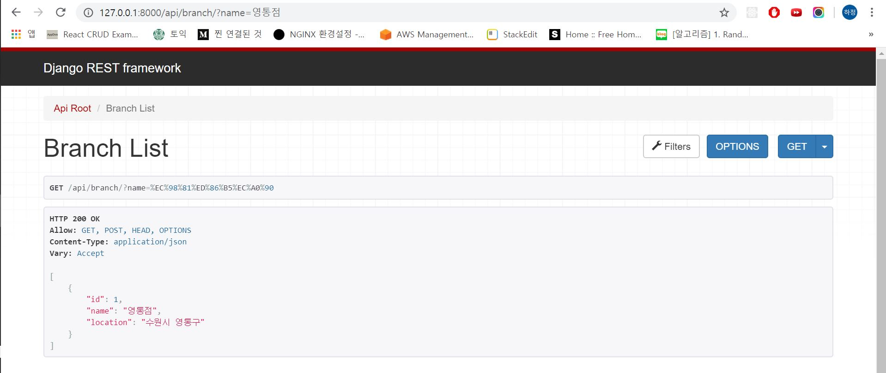 
  2. 영화 제목을 url에 검색시 필터링할 수 있는 MovieFilter
  ~~~
class MovieFilter(FilterSet):  
    title = filters.CharFilter(method='movie_title_filter')  
  
    class Meta:  
        model = Movie  
        fields = ['title']  
  
    def movie_title_filter(self, queryset, title, value):  
        title = self.request.query_params.get(title, None)  
        if title is not None:  
            queryset = queryset.filter(title=value)  
        return queryset
					#filter.py
  ~~~
~~~
class MovieViewSet(viewsets.ModelViewSet):  
    queryset = Movie.objects.all()  
    serializer_class = MovieSerializer  
    filter_backends = [DjangoFilterBackend]  
    filterset_class = MovieFilter
					    #views.py
~~~
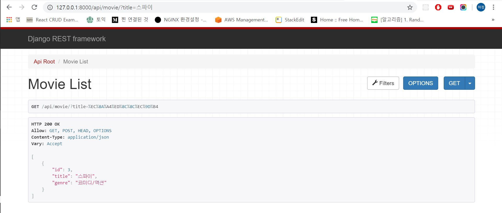
### permission 기능 구현하기
1.  로그인 하지 않은 사람은 한정된 방법(GET, HEAD, OPTIONS)만을 사용하여 정보를 볼 수 있도록 permission 설정
--> 결과화면에 원래 put할 수 있도록 뜨던 하단의 입력란이 뜨지 않는 것을 볼 수 있음
2. 로그인 하지 않은 사람이 user에 접근 할 수 없도록 permission 설정
~~~
SAFE_METHODS = ('GET', 'HEAD', 'OPTIONS')  
  
#로그인 하지 않은 사람은 한정된 방법만을 사용할 수 있음  
class IsAuthenticatedOnly(permissions.BasePermission):  
    def has_permission(self, request, view):  
        if request.method in permissions.SAFE_METHODS:  
            return True  
 return request.user.is_authenticated  
  
#로그인 하지 않은 사람이 접근할 수 없게  
class IsNotAnonymous(permissions.BasePermission):  
    def has_permission(self, request, view):  
        if request.user.is_anonymous:  
            return False
      
class UserViewSet(viewsets.ModelViewSet):  
    queryset = User.objects.all()  
    serializer_class = UserSerializer  
    permission_classes = (IsNotAnonymous,)

class MovieViewSet(viewsets.ModelViewSet):  
    queryset = Movie.objects.all()  
    serializer_class = MovieSerializer  
    filter_backends = [DjangoFilterBackend]  
    filterset_class = MovieFilter  
    permission_classes = (IsAuthenticatedOnly,)  
  
  
class ScheduleViewSet(viewsets.ModelViewSet):  
    queryset = Schedule.objects.all()  
    serializer_class = ScheduleSerializer  
    permission_classes = (IsAuthenticatedOnly, )
~~~
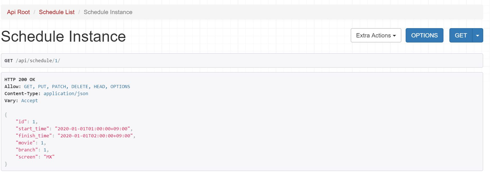
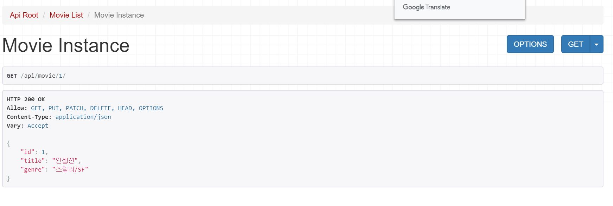
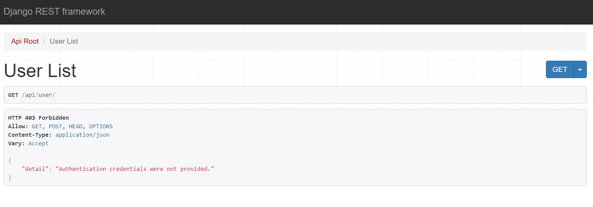
### 6주차 간단한 회고
	filtering 같은 경우에는 검색을 많이 할 것 같은 단어(영화관 지점, 영화 이름) 대상으로 해봤습니다! 
	permission은 두 개가 거의 유사하지만 user모델에는 로그인하지 않은 사람이 
	safe한 방법으로도 접근할 수 없게끔 해야될 것 같아서 따로 분리했습니다.
	이 과제를 하면서 filtering을 단순히 objects.filter()로 하는 방법말고도 
	method로 구현해서 url에 있는 parameter를 뽑아내어 필터링 하는 방법을 알게 되었습니다.
	수정할 부분 있으면 언제든지 알려주세요 감사합니다😊😊😊

    
