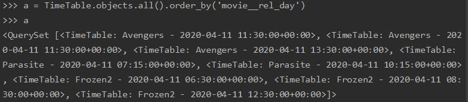

# django REST framework 과제 (for ceos 11th)

### 서비스 설명

영화관 선택은 배제하고, 영화 예매, 리뷰 서비스를 모델링 해보았습니다.

- 회원가입 -> 영화를 예매하기 위해서 영화를 선택 -> 다른 사람들의 리뷰를 확인  
  -> 영화 선택후 관란 시간표에서 시간을 선택 -> 영화 관람한 회원만 (권한을 주어) 리뷰 작성 가능
- 보고싶은 영화를 WishList 를 만들어 관리

### 모델 설명

가장 기본이 되는 모델로는 User, Movie, Booking 3가지로 잡았고,
하위 모델로는 TimeTable, Review, WishList 가 있습니다.

1. User : AbstractUser 사용하여 필드 변경

   - email: EmailField
   - username: CharField
   - gender: SmallIntegerField(choices=GENDER_CHOICES)
   - phone

   -> 로그인을 이메일로

2. Movie

   - title: CharField
   - director: CharField
   - genre: CharField
   - country: CharField
   - rel_day: DateTimeField
   - poster: ImageField

3. TimeTable

   - TimeTable - Movie (N : 1)
   - time = models.DateTimeField

4. Review

   - Review - User (N : 1)
   - Review - movie (N : 1)
   - rate: SmallIntegerField(choices=RATE_CHOICES) - 별점 1~5개중 choice
   - comment: CharField : 너무 길지않은 코멘트

5. Booking

   - Booking - user (N : 1)
   - Booking - movie (N : 1)
   - Booking - TimeTable (N : 1) - 예약한 영화 시간
   - booking_time = DateTimeField - 예약을 행한 그 시간
   - num = IntegerField

6. WishList
   - WishList - user (N : 1)
   - WishList - movie (1 : 1) - WishList 에 같은영화는 한번밖에 들어가지 못함

### ORM 적용해보기
1. Movie 객체 생성

2. Movie 객체 save

여기서 DateTimeField 에 대한 RuntimeWarning 이 발생하는데 어떻게 해결해야하는지 모르겠습니다.  
settings.py 에서 **USE_TZ = True : 장고 내부적으로 시간대를 인식, USE_TZ = False: TIME_ZONE 을 참고하여 local time 사용** 이라고 찾아서 False 로 해봤지만 여전히 warning 은 뜨네요.
그래도 저장은 잘 됩니다.

3. TimeTable 객체 생성 및 save
TimeTable 의 객체도 동일하게 생성해주고, Movie 를 ForeignKey 로 받아오므로 Movie 객체를 넣어줍니다.

  
4. Timetable 객체를 ForeignKey 로 연결된 Movie 의 rel_day 필드 순으로 정렬해 보았습니다.

### 간단한 회고

모델링을 시작하면서 욕심이 생겨, 많이 써보지 못했던 필드나 방법들을 사용해보고 싶었습니다.  
처음 User 모델링을 하면서도 처음부터 다 짜보고 싶은 마음에 AbstractBaseUser 을 사용하여 처음부터 다 구현을 해보고자 했습니다.
공부를 계속 하다보니 유저 모델링을 처음부터 다 구현을 하는 경우는 유저의 형태가 여러가지가 있어서 새로 구현할 수 밖에 없을 때
하는것이 좋다는 것을 알게되어 수정하는 것으로 방향을 바꾸게 되었습니다.  
모델링이라는 것이 필요한 모델들, 어떤 필드들을 사용할 것인지, 모델간의 관계 등을 먼저 정리를 해두고 시작해야 한다는 것을 깨달았습니다.
모델링을 하면서 생각해봐야할 부분들, 쓸 수 있는 것들을 최대한 많이 써보고 찾아보면서 이해하려고 노력했던 것이 큰 도움이 될 것 같습니다.
이전에 데이터베이스에 대해는 생각도 안해봤고, 전혀 몰랐다면, ORM 을 공부하고 백엔드에서의 모델링이 어떻게 데이터베이스에 저장되고 사용할 수있는지를
조금이나마 느끼게 되서 정말 도움이 많이 되었던 시간이었습니다.  
아직 많이 부족해서 찾아보고, 공부하는데 남들보다 많은 시간을 쏟고 있는것 같지만, 그만큼 배우는게 많은 것 같아 잠도 줄이고 공부하게 되는것 같습니다.  
과제를 통해 공부를 해야할 단계와 좋은 방향을 제시해주셔서 감사합니다!!

ps. bash 에서는 가상환경이 계속 켜지지 않아서, 그냥 PowerShell 터미널에서 python shell 을 진행했습니다. bash에서 가상환경이 켜지지않는 경우를 검색해서 계속 해결중인데 아직 원인을 못찾았습니다..ㅠㅠ
