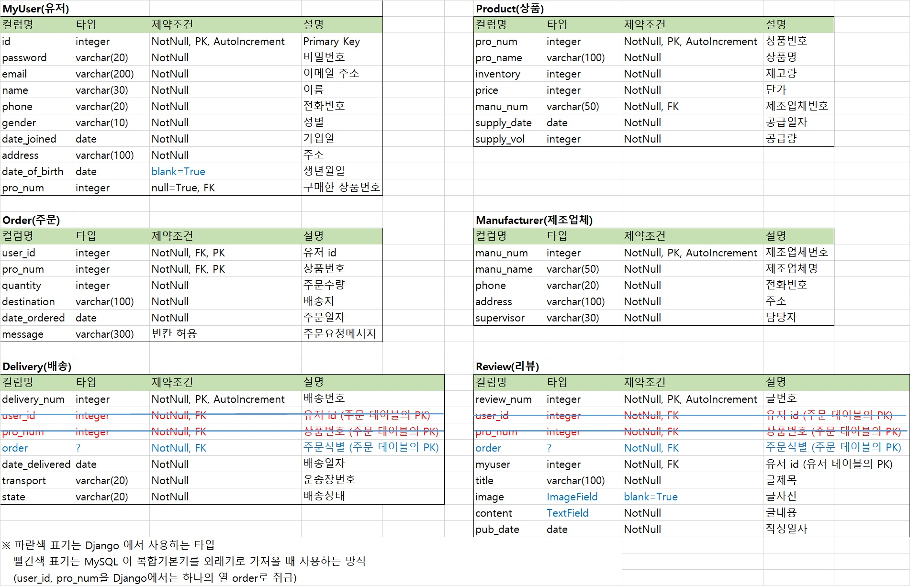
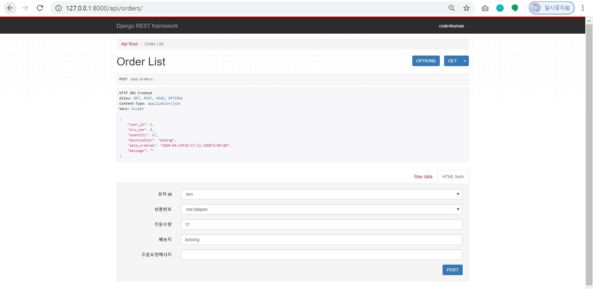
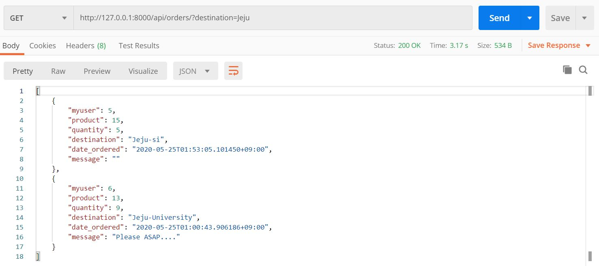

# django REST framework 과제 (for ceos 11th)
 
## 2주차 과제 (기한: 4/12 일요일까지)
[과제 안내](https://www.notion.so/3-Django-ORM-c531472b37e844a6a6d484553037c243)

### 서비스 설명

<쇼핑몰 서비스> <br>
쇼핑몰에서 가장 핵심적인 `'유저', '상품', '주문', '배송', '제조업체', '리뷰' ` 테이블을 설계했습니다. <br>
쇼핑몰 유저가 회원가입 혹은 로그인을 합니다. <br>
그리고 마음에 드는 상품을 주문합니다. <br>
주문이 들어간 상품은 배송 절차를 밟게 됩니다. <br>
배송완료된 상품을 받아본 유저는 리뷰를 작성합니다. <br>

### 모델 설명
* 테이블 설계도


* E-R Diagram (Type1)


* E-R Diagram (Type2)


### ORM 적용해보기

* 테이블 생성된 모습


* shell

  


### 간단한 회고 
DB sql 문법과 Django ORM 문법이 달라서 원하는 논리를 풀어내는 데 시간이 걸렸습니다. <br>
모델 간 관계가 이상해져서 api/migrations 에 있는 파일들을 여러번 삭제하고 다시 반영했습니다. <br>
'유저:상품' 간의 관계가 N:M 관계인데 '주문' 테이블을 중개모델로 설정했는데 N:M 관계가 잘 잡힌 건지 헷갈립니다ㅠ<br> 

---
## 3주차 과제 (기한: 4/19 일요일까지)
[과제 안내](https://www.notion.so/4-DRF1-API-View-464f612bfd9e42e5945325a4ad253cbf)

## 모델 선택 및 데이터 삽입
* 선택한 모델 : Order(주문) <br>
<b>Order(주문) 테이블</b>은 `MyUser(유저), Product(상품), Delivery(배송), Review(리뷰)`와 관계를 가집니다.<br>

```python
class MyUser(models.Model):
    user = models.OneToOneField(User, null=True, on_delete=models.CASCADE)
    # User 모델에 password, email, username 이 존재하므로 생략
    # password = models.CharField('비밀번호', max_length=20)
    # email = models.EmailField('이메일 주소', max_length=200, unique=True)
    name = models.CharField('이름', max_length=30, default='')
    phone = models.CharField('전화번호', max_length=20)
    GENDER = (
        ('male', '남성'),
        ('female', '여성'),
        ('neither', '선택 안함'),  
    )
    gender = models.CharField('성별',  max_length=10, choices=GENDER, default='male')
    date_joined = models.DateTimeField('가입일', default=timezone.now)  
    address = models.CharField('주소', max_length=100)
    date_of_birth = models.DateField('생년월일', null=True, blank=True)

    # Product 와의 관계 N:M
    product = models.ManyToManyField(
        'Product',
        through='Order',
        through_fields=('myuser', 'product'),
        related_name='purchased_users',
        verbose_name='구매한 상품',
    )

    class Meta:
        verbose_name = '유저'   
        verbose_name_plural = '유저' 
        ordering = ('-date_joined',) 

    def __str__(self):
        return self.name


class Product(models.Model):
    pro_num = models.AutoField('상품번호 PK', primary_key=True) 
    pro_name = models.CharField('상품명', max_length=100)
    inventory = models.IntegerField('재고량')
    price = models.IntegerField('단가')
    manufacturer = models.ForeignKey(
        'Manufacturer',
        on_delete=models.CASCADE,
        related_name='products',
        max_length=50,
        verbose_name='제조업체',
    )
    supply_date = models.DateTimeField('공급일자', default=timezone.now)
    supply_vol = models.IntegerField('공급량')

    class Meta:
        verbose_name = '상품'
        verbose_name_plural = '상품'
        ordering = ('-supply_date',)  

    def __str__(self):
        return self.pro_name


# MyUser 와 Product 의 중개 모델(intermediate model)
class Order(models.Model):
    myuser = models.ForeignKey(MyUser,
                                on_delete=models.CASCADE,
                                related_name='orders',
                                verbose_name='유저')
    product = models.ForeignKey(Product,
                                on_delete=models.CASCADE,
                                related_name='orders',
                                verbose_name='상품')
    quantity = models.IntegerField('주문수량')
    destination = models.CharField('배송지', max_length=100)
    date_ordered = models.DateTimeField('주문일자', default=timezone.now) 
    message = models.CharField('주문요청메시지', max_length=300, blank=True)

    class Meta:
        unique_together = (
            ('myuser', 'product')
        )
        verbose_name = '주문'
        verbose_name_plural = '주문'
        ordering = ('-date_ordered',) 


class Delivery(models.Model):
    delivery_num = models.AutoField('배송번호 PK', primary_key=True)   
    order = models.ForeignKey('Order',
                              on_delete=models.CASCADE,
                              related_name='deliveries',
                              verbose_name='주문식별')

    date_delivered = models.DateTimeField('배송일자', default=timezone.now)
    transport = models.CharField('운송장번호', max_length=20)
    STATE = (
        ('preparing', '상품준비중'),
        ('departure', '배송출발'),
        ('in_progress', '배송중'),
        ('completed', '배송완료'),
    )
    state = models.CharField('배송상태', max_length=20, choices=STATE, default='preparing')

    class Meta:
        verbose_name = '배송'
        verbose_name_plural = '배송'
        ordering = ('-transport',) 

    def __str__(self):
        return self.delivery_num


class Review(models.Model):
    review_num = models.AutoField('글번호 PK', primary_key=True)  
    myuser = models.ForeignKey('MyUser',
                               on_delete=models.CASCADE,
                               related_name='reviews',
                               default=1,
                               verbose_name='유저')
    order = models.ForeignKey('Order',
                              on_delete=models.CASCADE,
                              related_name='reviews',
                              verbose_name='주문식별')
    title = models.CharField('글제목', max_length=100, default='')
    image = models.ImageField('글사진', blank=True)   
    content = models.TextField('글내용', default='')
    pub_date = models.DateTimeField('작성일자', default=timezone.now)

    class Meta:
        verbose_name = '리뷰'
        verbose_name_plural = '리뷰'
        ordering = ('-review_num',)  

    def __str__(self):
        return '[{}] {}'.format(self.myuser.name, self.title)
```

* 데이터 삽입 후 


## 모든 list를 가져오는 API
URL : api/orders/ <br>
Method : GET
```json
[
    {
        "id": 6,
        "quantity": 15,
        "destination": "Gwangju",
        "date_ordered": "2020-04-19T18:30:55+09:00",
        "message": "Please call me before arrival.",
        "user_id": 1,
        "pro_num": 3
    },
    {
        "id": 5,
        "quantity": 20,
        "destination": "jongro",
        "date_ordered": "2020-04-19T18:30:39+09:00",
        "message": "Please put it in my mailbox.",
        "user_id": 2,
        "pro_num": 2
    },
    {
        "id": 4,
        "quantity": 10,
        "destination": "Busan",
        "date_ordered": "2020-04-19T18:30:06+09:00",
        "message": "ASAP!!!!!!!!",
        "user_id": 3,
        "pro_num": 1
    }
]
```


## 특정한 데이터를 가져오는 API
URL : api/orders/<int:pk>/ <br>
Method : GET
```json
{
    "id": 5,
    "quantity": 20,
    "destination": "jongro",
    "date_ordered": "2020-04-19T18:30:39+09:00",
    "message": "Please put it in my mailbox.",
    "user_id": 2,
    "pro_num": 2
}
```


## 새로운 데이터를 create하도록 요청하는 API
URL : api/orders/  <br>
Method : POST

```json
{
    "user_id": 1,
    "pro_num": 2,
    "quantity": 17,
    "destination": "dobong",
    "date_ordered": "2020-04-19T19:17:13.186872+09:00",
    "message": ""
}
```



## (선택) 특정 데이터를 삭제 또는 업데이트하는 API
위의 필수 과제와 마찬가지로 요청 URL 및 결과 데이터를 보여주세요! <br>

## 간단한 회고
Serializers에 관해서는 DRF 공식문서가 유일한 리소스인 것 같아 조금 답답했습니다. <br>
튜토리얼 코드 한줄한줄의 의미에 대해서는 조금 더 공부가 필요한 것 같습니다..! <br>
Django의 User를 OneToOneField로 관계 맺어 유저모델을 만든 경우에 Serializer 생성하면서 많은 삽질을 했습니다. <br>
계속 user_id가 null이 될 수 없다는 오류가 떠서 할 수 없이 아래와 같이 변경했습니다ㅠㅠ<br>

```python
# models.py의 MyUser
user = models.OneToOneField(User, null=True, on_delete=models.CASCADE)
```


---
## 6주차 과제 (기한: 5/24 일요일까지)
[과제 안내](https://www.notion.so/6-DRF3-filter-and-permission-73251e36d84d42af878574c13a0949b1)

## 과제 진행 내용 
### filter:
5주차 과제에서 filter가 포함된 @action을 작성하였기에, <br>
6주차에서는 2개의 뷰(ProductViewSet, OrderViewSet)를 filterset으로 리팩토링해보았습니다.<br>
#### * ProductFilter <br>
테이블 api_product <br>


name필터 : api/products/?name=pencil <br>


is_soldout필터 : api/products/?is_soldout=true <br>


than_hundred필터 : api/products/?than_hundred=true <br>


#### * OrderFilter <br>
테이블 api_order <br>


destination필터 : api/orders/?destination=jeju <br>


### permission: 
원래는 @action별로 permission을 적용하고 싶었으나 아직 이해가 부족해 view 별로만 간단히 적용하였습니다. <br>


## 간단한 회고
#### 알게된 점
하나의 뷰에 대해 필터를 걸기 위해 뷰의 쿼리셋은 지워야한다고  생각했는데 그게 아니었습니다.<br>
오히려 뷰셋의 쿼리셋을 지우니 아래와 같은 오류가 떴습니다.<br>
`AssertionError: 'ProductViewSet' should either include a `queryset` attribute, or override the `get_queryset()` method.`

#### 곤란했던 점
* django-filters 와 django-rest-framework-filters을 믹스매치해서 사용해보고 싶었으나 그러지 못했습니다. <br>
<b>오류 해결과정)</b><br> 
[django-rest-framework-filters의 RelatedFilter로 필터링하면 다중 관계를 쉽게 넘나들 수 있다](https://pypi.org/project/djangorestframework-filters/#can-i-mix-and-match-django-filter-and-django-rest-framework-filters) 고 하여<br>
RelatedFilter를 사용해보려고 욕심을 냈으나 아래와 같은 six 오류가 발생했습니다.<br>
`ImportError: cannot import name 'six' from 'django.utils'` <br>
위 오류가 `pip install djangorestframework-filters` 이후에 나타난 오류라서, 높은 버전의 장고를 지원하지 않아서 그렇다고 판단했습니다. <br>
따라서 Django==2.2.8로 reinstall 해주었지만 또 다른 오류가 발생했습니다. <br>
`ImportError: cannot import name 'QUERY_TERMS' from 'django.db.models.sql.constants'` <br>
그래서 아예 django-filters만 사용해야겠다고 생각하여 `pip uninstall djangorestframework-filters` 하고  <br>
다시 Django==3.0.5.로 설정했지만 six 오류는 계속되어 아예 `pip install six` 하고 settings.py에 INSTALLED_APPS에 six를 추가했습니다. <br>
이후에도 서버를 켤 수 없게 되고 아래와 같은 오류가 났습니다. <br>
`AttributeError: module 'django_filters.rest_framework.filters' has no attribute 'FilterSet'` <br>
임포트하는 부분에서 `from django_filters.rest_framework import FilterSet, filters`를 `from django_filters import rest_framework as filters`로 바꿔보니 서버를 실행시킬 수 있었습니다. 

#### 궁금한 점
-- ViewSet의 @action과 기능이 겹치는 Filter를 제작한 경우에 둘 중 하나를 지우면 좋을지, 둘 중 어느 것을 지우는 것이 좋을지 궁금합니다. <br>
-- Filter 클래스의 Meta 클래스에 있는 fields = []는 filterset_fields일텐데 어떤 역할인지 궁금합니다.<br>
-- 아래 두 코드의 차이가 궁금합니다.<br>
`from django_filters.rest_framework import FilterSet, filters` <br>
`from django_filters import rest_framework_filters as filters`


